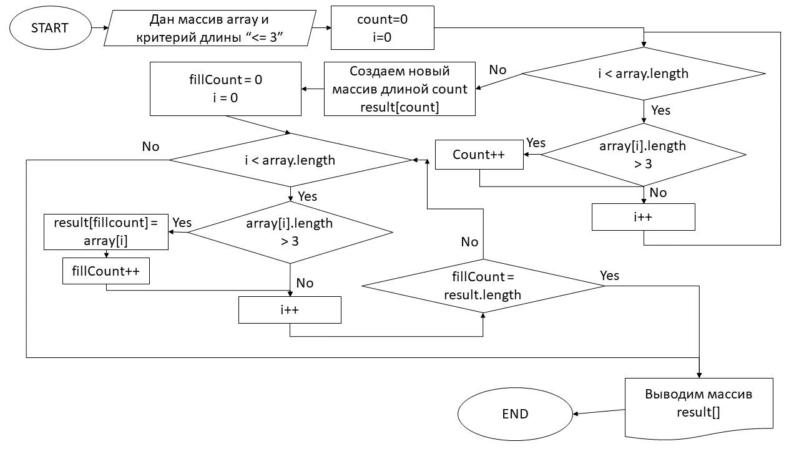

# Задача.

Написать программу, которая из имеющегося массива строк формирует массив из строк, длина которых меньше либо равна 3 символа. Первоначальный массив можно ввести с клавиатуры, либо задать на старте выполнения алгоритма. При решении не рекомендуется пользоваться коллекциями, лучше обойтись исключительно массивами.

# Описание к решению.

## **Подсчет количества элементов соответствующих условию.**
Сначала подсчитывается количество искомых строк (длиной 3 и менее символа) в заданном масииве. Количество таких строк определяется для создания массива только необходимой длины.

Эта функция реализована в методе:
```c#
int CountStringsByLengthInArray(string[] inputArray, int givenMaxLength);
```

Метод пробегает по всем элементам переданного в него массива (аргумент `inputArray`) в цикле `for` и сравнимает их длину с заданной (которая определяется аргументом `givenMaxLength`).

Если длина соответствует критерию, он увеличивает результирующую переменную `result` на единицу.

По завершению цикла `for` метод возвращает переменную `result`.


## **Формирование результирующего массива**
Создается массив строк необходимой длины и в него переносятся значения, соответствующие критерию (длина <= 3).
Эта функция реализована в методе
```c#
string[] FilterStringsArrayByMaxLength(string[] inputArray, int givenMaxLength);
```
Метод сначала объявляет результирующий массив необходимой длины используя ранее описанный метод `CountStringsByLengthInArray`, передавая туда исходный массив и максимальную заданную длину.

Также метод объявляет и инициализирует с нулевым значением счетчик заполнения результирующего массива `fillCount` (для определения на какую позицию, ставить очередной элемент).

После чего метод пробегает по всем элементам исходного массива (аргумент `inputArray`) в цикле for и сравнивает их длину с заданой (которая определяется аргументом `givenMaxLength`). Если критерий выполняется, то текущий элемент исходного массива копируется в ранее созданный результирующий массив на позицию `[fillCount]`, а также увеличивается на единицу счетчик заполнения fillCount.

Для оптимизации алгоритма, при заполнении результирующего массива (`fillCount >= длины результирующего массива`) цикл обрывается. Т.е., если мы знаем, что уже переложили все элементы соответствующие критерию, то мы не будем пробегать исходный массив до конца.

## **Вывод результата и вспомогательные методы**

Также в программе реализованы вспомогательные методы:
```c#
int ReadNaturalInt(string promtingMessageForUser);

void FillStringArrayFromConsole(string[] inputStringArray);

void PrintStringArray(string[] inputStringArray);
```
Результат решения задачи выводится на экран через метод `PrintStringArray`, который пробегает по всем элементам массива в цикле `for` и выводит их на экран через ", ", и при этом в начале строки ставит "[", а в конце - "]".

Функции других двух методов очевидны из названия, а используемые алгоритмы примитивны, поэтому не буду давать им подробного описания.

## Алгоритм решения
Алгоритм вложен картинкой: 